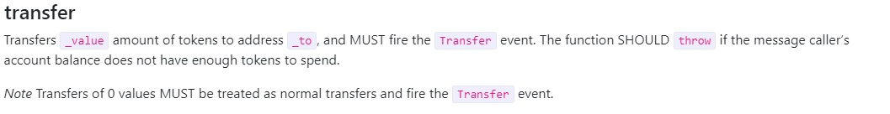

# 💲 Unsafe ERC20 Operations

## **Understanding ERC20 Tokens and the Need for Strict Standards**

Introduced through Ethereum Improvement Proposal 20 (EIP-20), the ERC20 standard outlines key functionalities such as transferring tokens and give allowance.

While the standard has enable a surge in digital asset creation, it comes with its limitations.<br>
Primarily, ERC20 only suggests guidelines rather than enforceable rules.<br>
This has led to a varied implementation of these guidelines by developers, which, in turn, introduces inconsistencies.<br>
A critical aspect of these inconsistencies is the error handling mechanism, tokens might return a false value on transaction failures, while others might revert the transaction entirely.<br>
This lack of a uniform approach can lead to unsafe operations, as applications might not uniformly anticipate or handle failures, potentially leading to loss of funds or other security issues.


### **The Challenge: No Standard Way to Safely Interact with ERC20 Tokens**

The ERC20 standard revolutionized the ecosystem by providing a blueprint for token creation. However, it left a lot to be desired in terms of security and reliability.<br>
One of the most pressing issues is the lack of a uniform method for safely interacting with these tokens.<br>
This gap in the standard has led to a variety of implementations.

## The Core of the Issue

At its core, the ERC20 standard specifies a set of functions and events that a token contract should implement, but it does not dictate how these functions should handle failures.<br><br>
For instance, the **`transfer`** and **`transferFrom`** functions are used to move tokens between accounts, traditionally return a Boolean value indicating success or failure.<br>
However, not all implementations adhere strictly to this pattern.<br> 
Some might choose to revert (i.e., throw an error and undo all changes) on failure.
This inconsistency can lead developers to make incorrect assumptions about the behavior of tokens, leading to bugs and vulnerabilities in smart contracts that interact with these tokens.

## A Real-World Example

This is how the function interface should look like from the [Original EIP](https://eips.ethereum.org/EIPS/eip-20) : 
```solidity
    function transfer(address _to, uint256 _value) public returns (bool success)
```



To illustrate the potential dangers, let's check issue found in Solodit from JuiceBox's Audit in Code4rena.<br>

### Here's a internal **'_transferFrom'** function: 


```solidity
   function _transferFrom(
    address _from,
    address payable _to,
    uint256 _amount
  ) internal override {
    _from == address(this)
      ? IERC20(token).transfer(_to, _amount)
      : IERC20(token).transferFrom(_from, _to, _amount);
  }
```

In this code, the devs are using a common IERC20 Interface for dealing with regulars ERC20.<br>
However, as this interface follows the ERC20 standard, it require a boolean return value. 

The function will not work for a number of popular ERC20s (USDT, BNB..) as they don't return any value.

This is what the BNB **'transfer function'** looks like: 

```solidity
function transfer(address _to, uint256 _value) { // Doesn't return any value
        if (_to == 0x0) throw;
		if (_value <= 0) throw;
        if (balanceOf[msg.sender] < _value) throw;
        if (balanceOf[_to] + _value < balanceOf[_to]) throw;
        balanceOf[msg.sender] = SafeMath.safeSub(balanceOf[msg.sender], _value);
        balanceOf[_to] = SafeMath.safeAdd(balanceOf[_to], _value);                     
        Transfer(msg.sender, _to, _value);
    }
```

As you can see, there's no return value when the transfer is successful or not. 
It's just **'throw'**(revert) if the condition for trasfering are not met.

[BNB's verified Code from Etherscan](https://etherscan.deth.net/address/0xb8c77482e45f1f44de1745f52c74426c631bdd52#L77-L85)


[Solodit Finding](https://solodit.xyz/issues/m-03-use-a-safe-transfer-helper-library-for-erc20-transfers-code4rena-juicebox-juicebox-v2-contest-git)

## **Implementing SafeERC20 for Secure Token Interactions**


This is where OpenZeppelin's **`SafeERC20`** library comes into play, providing a robust framework for interacting with ERC20 tokens safely.

### How does it work ?
It which allow developers to manage token transfers more securely.<br>
Unlike standard methods, which fail silently or do not revert on errors, low-level calls enable handling of return values explicitly<br>
This means that if a token contract does not perform as expected, your contract can detect and handle this situation effectively.

**Using SafeERC20:**

```solidity

 function safeTransfer(IERC20 token, address to, uint256 value) internal {
        _callOptionalReturn(token, abi.encodeCall(token.transfer, (to, value)));
    }

 function _callOptionalReturn(IERC20 token, bytes memory data) private {
        // We need to perform a low level call here, to bypass Solidity's return data size checking mechanism, since
        // we're implementing it ourselves. We use {Address-functionCall} to perform this call, which verifies that
        // the target address contains contract code and also asserts for success in the low-level call.

        bytes memory returndata = address(token).functionCall(data);
        if (returndata.length != 0 && !abi.decode(returndata, (bool))) {
            revert SafeERC20FailedOperation(address(token));
        }
    }
```

So **`SafeERC20::safeTransfer`** will call the token's transfer's function.<br>
If there is no return from that function (from weird Tokens), it just go through, knowing that it would have revert if  there was an error.
Else, it check that the return value is a Bool and that it returns True, otherwise it revert.

So now the Library will throw an error if the trasfer fails, so devs don't have to manually check return values anymore. 


In contrast, **`SafeERC20:safeTransfer`** abstracts these checks within the library. It handles the intricacies of interacting with different implementations of the ERC20 interface, making your contract more robust and easier to maintain.


### **Using `SafeERC20` Effectively**

Integrating **`SafeERC20`** is straightforward.
Here's how you can incorporate it into your development process:


    
```solidity
    import "@openzeppelin/contracts/token/ERC20/utils/SafeERC20.sol";
```
```solidity
// And inside your contract
        using SafeERC20 for IERC20;
```

By adopting **`SafeERC20`**, you leverage OpenZeppelin’s extensive testing and community feedback, which can significantly enhance the security of your blockchain applications.<br>
Remember, in the ever-evolving landscape of blockchain technology, the importance of security cannot be overstated.<br>
Using tools like **`SafeERC20`** not only protects your projects but also contributes to a safer and more reliable ecosystem.


### Additionals ressources
- [WEIRD ERC20](https://github.com/d-xo/weird-erc20)
- [EIP-20](https://eips.ethereum.org/EIPS/eip-20)
