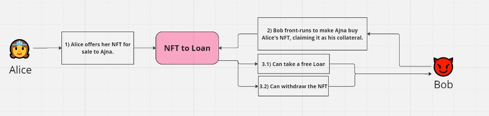
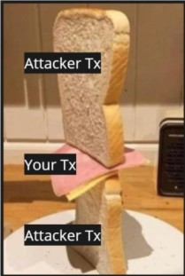
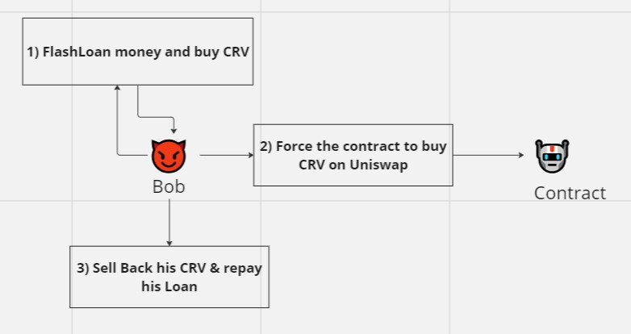
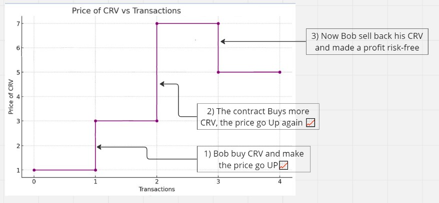

# 🏃💨️ Front/Back Running

## Introduction

In the fast-paced world of Web3, transaction speed can be a game-changer. 
However, this very characteristic introduces vulnerabilities like Front Running and Back Running. 
These exploits leverage the Mempool and gas fee system to manipulate transaction execution order for personal gain.

## Important Terminology: 
 ***Mempool***: This is a temporary holding area for transactions (tx) waiting to be validated. All these tx are publicly available to read by anyone before they are validated.  
 ***Base Fee***: This is the minimum fee required for transactions (tx) inclusion based on network congestion. 
 ***Priority Fee***: This is an optional fee users pay to validators to incentivize faster transactions (tx) processing. 

## Analogy
The ***Mempool*** in a crowded coffee shop is the line of customers waiting. 
The ***Base Fee*** is the coffee's minimum price, rising with demand. 
The ***Priority Fee*** is like tipping the barista to get your coffee first, jumping the queue."

So the higher your `priorityFee` is, the faster your tx will be executed.

A ***Front Run*** tx is submitted after the user's tx but gets validated before the user's tx.

A ***Back Run*** tx is submitted after the user's tx but gets validated after the user's tx.

The Front Runner will see your submitted tx in the mempool and simulate it. 

If there is a way that they make money, the Front Runner will pay higher ***Priority Fee*** so their tx will be validated first. 

## Example of Attacks
### Front Running

In this example in Ajna, a user can deposit NFT as collateral. 
Alice wants to deposit a Crypto Punk as collateral in order to take a Loan from Ajna. 

However, the `CRYPTOPUNKS` don't follow the ERC-721 standard. 
So following the `CRYPTOPUNKS` contract, the user has to Offer his `CRYPTOPUNK` for Sale to a specify Address, and then the address can buy it from the user.

1) Alice's Initial Transaction: Alice call the `CRYPTOPUNKS::offerPunkForSaleToAddress` function and specify the Ajna Address.
2) Alice's Second Transaction: Alice now send a tx, calling the `Ajna::addCollateral` which is going to buy the `CRYPTOPUNK` from Alice and accept her collateral.
3) Bob's Front Run: Bob sees that tx, and Front Run Alice's second tx, so the Ajna Protocol is indeed buying the token from Alice but as Bob initiate the tx, the collateral will be accepted in his name.
4) Bob has now two options
   1) He can have a Loan for free, so never repay back because the collateral was free.
   2) He can withdraw back the collateral and get the `CRYPTOPUNK` back. 
5) Alice has lost her `CRYPTOPUNK`.

Remediation: Before buying back the NFT from Alice, the protocol should verify that she is the one who initiated the transaction.

Note that the Front Runner himself can be Front Run by another one if ***Priority Fee*** is even higher.

[Front Run Attack Link](https://solodit.xyz/issues/h-3-cryptopunks-nfts-may-be-stolen-via-deposit-frontrunning-sherlock-ajna-ajna-git)

### Sandwich Attack

A Sandwich Attack is a form of Attack when an Attacker will Front Run & Back Run your tx. 

The idea is to place the smart contract in a state just before the victim's tx goes through and place another tx just after.

In this Attack, there's a function that has  improper access control. 
Therefore anyone can call it. 
This function make the Protocol to Buy some CRV token on Uniswap.  

1) Bob takes out a flash loan and buys CRV tokens, causing the price to rise 📈
2) Bob executes the Mochi Contract to buy some CRV tokens on Uniswap, causing the price to rise 📈
3) Bob's CRV tokens are now worth much more, allowing him to resell them at a higher price.
4) The Mochi Contract purchased CRV tokens at an inflated price, benefiting Bob.

Remediation: This was an improper access control. A regular user shouldn't have access to this function. Set a `onlyOwner` modifier.
   

[Sandwich Attack Link](https://solodit.xyz/issues/h-09-treasury-is-vulnerable-to-sandwich-attack-code4rena-mochi-mochi-contest-git)

## How to prevent them ? 

### FlashBots

Flashbots are a private Mempool that submit groups of transactions directly to validators, bypassing the public mempool.
Some of the validators agree not to publish the transactions submitted to their node publicly. 

Pro:

* ✔️ They can help prevent Front Running and Back Running by allowing users to prioritize their transactions.

Cons:

* ❌ They tend to be slow, because you'll need to wait until it's one of the validator's turn to validate a block.
* ❌ There is a part of centralization and trust. You have to trust that those validator are not going to Front Run you.

### MEV Awareness

* Understanding MEV risk: Knowing that these exploitative tactics exist puts you on guard.
discourages front-runners while ensuring your transaction gets processed.
* Identifying smart contract vulnerabilities: Awareness of MEV can lead you to identify potential vulnerabilities in your contract that attackers could exploit through MEV techniques.

## Conclusion

Front-running and Back Running are challenges in the fast-paced world of Web3. 
By understanding MEV (Maximal Extractable Value) you can protect your transactions. 
As Web3 evolves, new solutions like Layer 2 scaling and flashbots offer hope for a future with less MEV risk. 
Stay informed to navigate this dynamic landscape.

## Additional Resources

Best Article on MEV: [Ethereum is a Dark Forest](https://www.paradigm.xyz/2020/08/ethereum-is-a-dark-forest),  
Others Articles:
[MEV: DeFi Transaction Ordering for Profit and Fun](https://mixbytes.io/blog/mev-defi-transaction-ordering-for-profit-fun), 
[Solidity By Example](https://solidity-by-example.org/hacks/front-running/),

Mempool Live Visualization:
[Ethernow](https://www.ethernow.xyz/), 
[tx Town](https://tx.town/v/eth)
