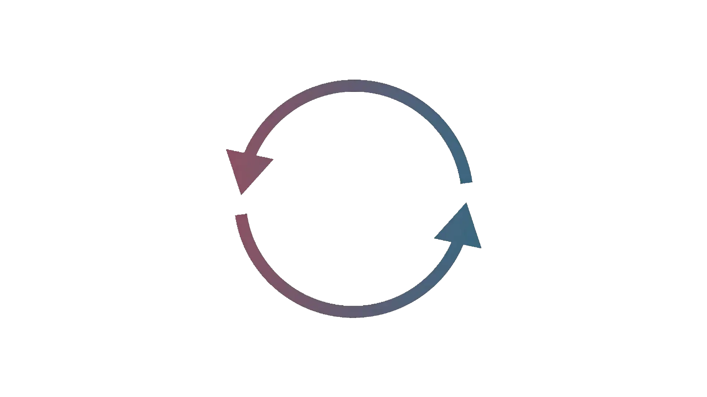

# 2⃣ The Meat of The Audit

### Pulling Threads

At this point, you understand the contract system at a high level. Now it's time to go back to your `@audit` tags and start pulling on threads.

Examine the execution path for any edge cases you tagged, and do some further digging for the questions you left.

Now is the time to start thinking about all the common attack vectors you have studied. As you pull threads, be on the lookout for all of the common bugs/vulnerabilities enumerated in the [encyclopedias (under construction)](../../encyclopedia-of-common-solidity-bugs/). In addition to common attack vectors, simple typos often yield critical bugs. Be sure to read each line carefully and look out for typos as you go.

As you see potential attacks or bugs leave an `@audit` tag and come back to them after you finish your current thread. Sometimes it might be helpful to write a PoC to test your potential attack and verify the behavior matches your expectations.

If you pull a thread and you decide it's a viable vulnerability/finding, add it to the findings doc with a precise description referencing exact line numbers. Ideally, other auditors should be able to understand the finding without reaching out for more context. After you add a finding to the doc, post it in the group or make a note to bring it up during a call so other auditors can learn from the finding.

Remember to make `@audit` tags for gas optimizations you notice along the way as well, although these are not a priority.

<figure><figcaption></figcaption></figure>

### Ideating Attack Vectors

After you've pulled all of your initial threads, you'll have a substantial amount of knowledge about the protocol and you'll need to come up with new threads to pull.

Firstly, run a static analyzer like [Slither](https://github.com/crytic/slither) and mark all of the interesting flags in-code with an `@audit` tag.

Many of the bugs and vulnerabilities that affect a codebase are particular to the protocol. Protocol-unique findings simply require context (which we already have) and creativity. Here's how we can hack creativity and come up with interesting bespoke attack vectors:

* Enumerate all of the knobs an attacker can control. What public/external functions are there? What state could they affect? Does it matter if some of these tx's are frontrun? Can sending ERC20 tokens or Ether to an address change the behavior of the contracts?\
  \
  Share this list with your fellow auditors. These are your legos to create attacks with, the more you have the better.\

* Utilize divergent thinking. Instead of verifying that an invariant holds, list the ways that it might break. Can you achieve any of these with the list of knobs you built?\
  \
  Ex - How can `amount into the vault != amount out of the vault`:
  * Fee-on-transfer tokens
  * The attacker front-runs someone to manipulate the vault token pricing
  * The attacker reenters on withdrawal
  * The attacker sandwich attacks a harvest
  * The attacker abuses some precision loss
  * The list goes on...

Once you've generated a few `@audit` tags and a handful of possible attack vectors, it's time to start pulling those threads again. Auditing is an iterative process of examining code paths, making `@audit` tags, learning more about the code, and coming up with new attack vectors.

<figure><figcaption></figcaption></figure>

If you truly run out of ideas/threads to pull on, do a deep review of every file, reading line-by-line and leaving `@audit` tags for things that you don't understand or seem off. This is a guaranteed way to yield more threads to pull on.


This is also a good stage to come up with invariants to later verify with security tools that perform fuzzing, symbolic analysis, or formal verification. More on this in "Security Tools" (under construction).


### Collaboration

When you stumble across something particularly alarming/confusing in the code, alert your fellow auditors. There's a good chance they noticed it too and have their own thoughts about it.

Discuss attack vectors as a group as much as possible, a lot of times you’ll hop on a call with an idea for an attack and it turns out to be invalid, but your fellow auditor has context on another part of the system that could combine with your idea to yield a valid vulnerability.

Invest heavily in the shared knowledge of your group. The corpus of the group allows you to ideate new attack vectors and validate/invalidate potential leads much faster than any individual auditor.
